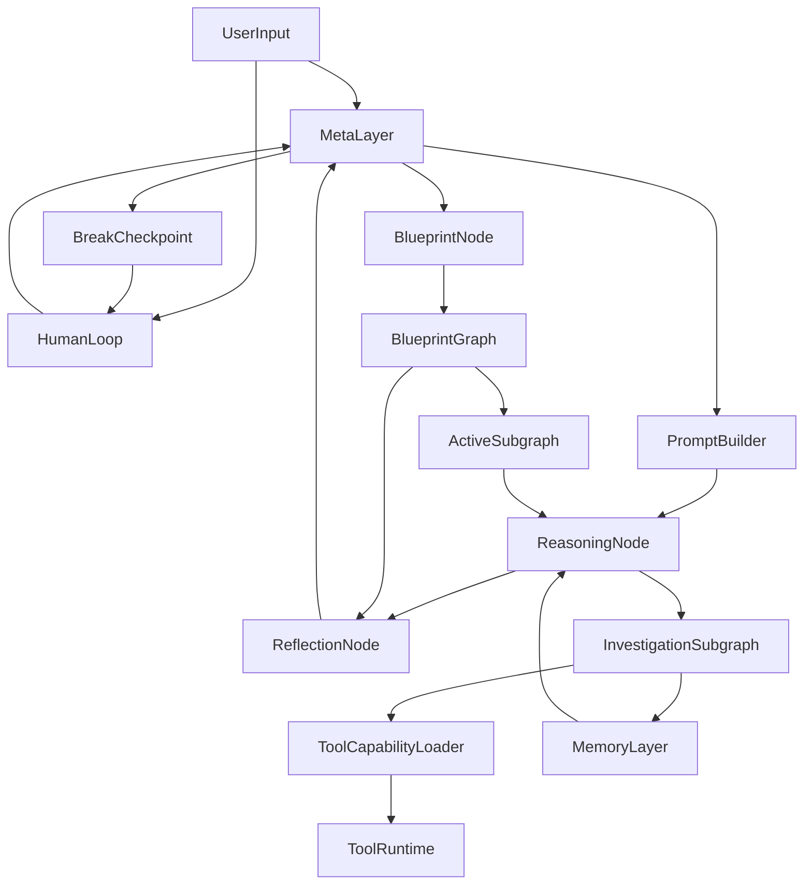
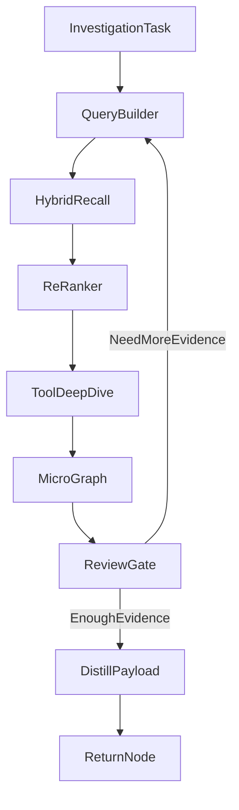

# Agent 系统架构设计报告

本报告基于 `Agent设计讨论.md` 中已经形成的分析结论与配套架构图，对整个软件项目的系统定位、总体架构、技术栈、实现路径与风险控制进行正式化整理。报告的目标不是描述一个普通的聊天应用，而是定义一套面向复杂知识生产任务的 `Agent OS / Cognitive Runtime`。

## 1. 项目定位

### 1.1 系统定义

该项目应被定义为一套面向复杂长周期任务的 Agent 操作系统，其核心能力不是“对话”，而是：

- 用图状态机组织复杂任务。
- 用分层记忆管理长上下文与历史状态。
- 用主动检索和调查子图完成外部知识与内部外存的精确寻址。
- 用隔离反思与回溯机制控制 hallucination、附和效应和逻辑漂移。
- 用模型路由、确定性快路径和状态快照实现成本与可靠性的平衡。

### 1.2 目标场景

该系统的第一落点应是高复杂度知识生产任务，尤其包括：

- 顶会级学术论文写作与论证。
- 论文、代码、实验日志的跨模态对齐分析。
- 大型代码库逆向理解与方案重构。
- 法律、科研、咨询等强逻辑闭环任务。

### 1.3 非目标

系统的首要目标不是：

- 通用聊天机器人。
- 低复杂度脚本自动化工具。
- 纯工具编排型 Generalist Executor。

这意味着架构优先级应放在认知控制、状态管理、证据闭环和可回溯性上，而不是 UI 花哨程度或单轮交互速度。

## 2. 核心设计原则

### 2.1 Main Graph 动态路由与 Blueprint 静态路由

采用 `Main Graph + Blueprint Graph + Execution Sub-graph` 的三层控制模型：

- `Main Graph` 是系统全局运行图，也是系统的主调度平面。它本身是一个动态图，`Meta` 在这个图上做动态路由。
- `Blueprint` 本身也是 `Main Graph` 中的一个节点，但它不是每次任务都必须进入。是否需要 Blueprint、何时进入 Blueprint，由当前实际需求和 `Meta` 的主图路由决定。
- 当进入 `Blueprint` 节点时，它内部会激活一张提前定义好的静态 `Blueprint Graph`。这张图本质上是一张静态路由图。
- `Blueprint Graph` 中的每个节点都对应一个新的执行 `Sub-graph`。执行时不是直接跑 Blueprint 文本，而是把当前 Blueprint 节点实例化成对应的执行子图。

因此，系统的执行关系应理解为：

- 先在 `Main Graph` 上做动态路由。
- 当主图判定当前任务或阶段需要静态计划约束时，再进入 `Blueprint` 节点。
- 激活 Blueprint 内部当前计划节点。
- 将该计划节点展开为一个执行 `Sub-graph`。
- 根据该 `Sub-graph` 的返回结果，在静态 Blueprint 图中决定下一条合法边。

在这个模型里，`Meta` 的职责不是“始终依赖 Blueprint 路由”，而是在 `Main Graph` 上做动态调度，并决定是否进入或退出 `Blueprint`。一旦进入 Blueprint，其内部阶段流转则由静态 `Blueprint Graph` 和当前节点返回结果共同决定。

### 2.2 物理级记忆隔离

`Reasoning` 与 `Reflection` 不应共享完整上下文。反思节点要尽量只看到必要事实、Blueprint 约束和待审结果，从机制上降低自我附和。

### 2.3 调查优先于检索

外部知识访问不应被建模为单次搜索调用，而应被建模为可循环、可工具增强、可早停的 `Investigation Graph`。无论访问文献库、代码仓库还是内部 Disk 外存，都应通过统一的调查接口处理。

### 2.4 状态先于文本

系统的主对象应是结构化状态，而不是长文本上下文。文本是状态的投影，而状态才是执行、回溯、压缩、恢复和审计的基础。

### 2.5 确定性快路径

没有分支的边不需要 Meta 思考。直线流程由死程序执行，真正的十字路口才交给 Meta 决策，从而降低成本并提升稳定性。

### 2.6 可回滚优先

复杂任务不可能一次成功，因此必须将 `Checkpoint`、`Break`、`Dump State` 和时间旅行式恢复作为一等能力设计。

### 2.7 认知诚实优先

系统必须具备“知道自己不知道”的能力。当证据不足、检索为空、工具不可用、事实冲突或 Meta 置信度过低时，系统应优先：

- 显式声明未知项。
- 给出缺失信息类型。
- 说明继续执行的风险。
- 把问题压缩后反馈给用户或上级控制器。

该机制的目标是防止系统为了保持连贯而胡编乱造。

## 3. 总体架构

### 3.1 架构分层

建议将系统划分为九层：

- `Interaction Layer`：用户输入、人类补充信息、审批与中断恢复。
- `Specification Layer`：Blueprint Graph、静态计划、合法分支、环路与评估规则。
- `Control Layer`：Meta 决策、主图与 Blueprint 展开态路由、预算、熔断与不确定性升级。
- `Cognition Layer`：Reasoning、Reflection、Prompt Builder 等核心认知节点。
- `Investigation Layer`：主动检索、工具深挖、微型图谱构建、证据闭环。
- `Capability Layer`：工具装载、能力裁剪、权限映射、工具集曝光控制。
- `Memory Layer`：RAM、Cache、Disk、全局黑板、压缩与解压。
- `Execution Layer`：模型网关、工具运行时、沙盒执行、任务队列。
- `Governance Layer`：日志、评估、权限、安全策略、可观测性。

### 3.2 总览图



### 3.3 全局运行逻辑

系统的典型运行闭环如下：

1. 用户输入任务后，系统首先在 `Main Graph` 上运行，由 `MetaLayer` 做动态路由。
2. `MetaLayer` 根据当前实际需求决定是否启用 `Blueprint`。如果当前任务更适合开放式探索，可以暂不进入 Blueprint；如果当前任务需要静态阶段计划或受控流程，则路由到主图中的 `Blueprint` 节点。
3. `Blueprint` 节点激活内部静态 `Blueprint Graph` 的当前计划节点。
4. 当前 Blueprint 节点被展开为对应的执行 `Sub-graph`，例如“与用户讨论并调查文献”或“根据文献和 idea 形成写作思路”。
5. `ReasoningNode` 执行当前小步任务，必要时发起 `InvestigationSubgraph`。
6. `InvestigationSubgraph` 根据当前状态先装载适当工具，再通过混合检索、工具深挖和微型图谱收敛证据。
7. `ReflectionNode` 在 Blueprint 评审准则与事实指针下进行隔离审查。
8. 当前执行子图返回结构化结果，`Blueprint Graph` 根据返回结果选择下一条合法边，并切换到下一个 Blueprint 节点。
9. 当静态 Blueprint 阶段结束、被中断或被判定不再适用时，控制权回到 `Main Graph`，继续由 `MetaLayer` 做全局动态路由。
10. 当系统识别到未知项无法消解时，必须生成结构化问题反馈给用户，而不是继续猜测。
11. 每个关键节点可触发压缩、快照和状态持久化。

## 4. 核心模块设计

### 4.1 Meta 层

Meta 层是系统的控制平面，不负责直接生成长内容，而负责以下事项：

- 在 `Main Graph` 上做动态路由，并决定是否进入、恢复、中断或退出 `Blueprint` 节点。
- 选择使用哪一个模型档位。
- 决定是否触发 Investigation。
- 决定是否切换 Blueprint 分支或重新进入某个 Blueprint 环路。
- 决定挂载哪些记忆和事实。
- 决定当前需要暴露哪些工具能力。
- 决定是否 break、是否回滚、是否升级为人工介入。
- 在不确定性过高时生成用户反馈问题。

为了避免单点故障，建议将 Meta 层拆成四类微型控制器：

- `Strategist`：结合主图状态、活跃 Blueprint 节点、当前进度和目标差距，决定下一步的逻辑动作。
- `ResourceManager`：只负责模型档位、预算和成本策略。
- `MemoryRouter`：只负责检索意图生成、载荷裁剪和记忆挂载。
- `CapabilityRouter`：只负责按当前状态动态装载工具集，并限制模型看到的可用能力范围。

这三个角色可以在实现上由同一个强模型完成，但在接口和输出结构上应逻辑拆分。

### 4.2 Blueprint 模块

`Blueprint` 既是主图中的一个高阶节点，也是一个静态计划图容器。它不是默认必须启用的组件，而是一种按需使用的静态路由机制。进入这个节点后，系统不是得到一段文本计划，而是得到一张可执行的静态 `Blueprint Graph`。

Blueprint 允许存在：

- 分支。
- 环路。
- 阶段回退。
- 子图模板复用。

它必须承担四种职责：

- 定义任务的全局结构和阶段目标。
- 定义每个 Blueprint 节点对应的 Sub-graph 类型或模板。
- 为 Reflection 提供只读评判准则。
- 定义每个 Blueprint 节点在返回不同结果时可走的后继边。

Blueprint 中建议至少包含：

- 任务主目标。
- Blueprint 节点定义。
- Blueprint 节点之间的合法边与环。
- 每个节点允许调用的子图模板。
- 每个节点的返回类型与后继选择规则。
- 必须满足的质量标准。
- 不允许跨越的状态边界或提前跳转规则。
- 当前阶段应该关注的评估项。

对于论文场景，Blueprint 应覆盖章节结构、核心贡献、对比对象、实验约束、图表规划和关键审稿检查项。

例如，对于论文写作任务，Blueprint 可以静态定义为：

1. 与用户讨论，调查相关文献。
2. 根据文献与 idea 分析，给出可行的写作思路。
3. 收敛论文主线、创新点和实验对比策略。
4. 进入具体章节或图表规划子图。

其中每个步骤都不是一句提示词，而是一个 Blueprint 节点；每个节点执行时都会展开为一个新的 `Sub-graph`。该子图返回如 `done`、`need_more_evidence`、`need_user_input`、`retry` 等结果，Blueprint 再依据这些返回结果选择下一条静态合法边。

换句话说，`Main Graph` 负责“全局上现在要不要进入计划化执行、什么时候退出计划化执行、什么时候切回开放式动态路由”；`Blueprint` 负责“进入计划化执行之后，每个静态阶段在返回何种结果时该走向哪个下一阶段”。

### 4.3 Reasoning 节点

`ReasoningNode` 是主要的高层思考与生产节点，但它不应直接接触所有原始材料。它应只接收：

- 当前阶段目标。
- 当前活跃 Blueprint 节点对应的 plan 切片。
- 当前有效载荷 `Payload`。
- 必要的事实摘要。
- 当前 RAM 的核心上下文。

Reasoning 节点负责：

- 生成阶段性结果。
- 识别信息缺口。
- 触发 Investigation。
- 输出结构化中间结论。

它不应兼任状态路由、全文检索或长上下文清洗任务。

### 4.4 Reflection 节点

`ReflectionNode` 是系统的独立审查器，应尽量保持物理级隔离。其核心职责包括：

- 检查是否符合 Blueprint 当前阶段要求。
- 检查论证是否闭环。
- 检查是否缺少关键事实或对比。
- 检查输出是否偏题、漂移或自我美化。
- 决定是否允许结束 Investigation 或放行当前阶段结果。

Reflection 需要两类输入：

- 任务性标准：来自 Blueprint 的规则和 Checklist。
- 客观性标准：来自事实指针、实验 JSON、已确认符号表等只读对象。

它不能只看创作过程，否则会重新引入附和效应。

### 4.5 Investigation 子图

`InvestigationSubgraph` 是该系统区别于普通 RAG 的关键模块。它不是单步检索，而是一个可循环的调查子系统。

其标准流程建议如下：



Investigation 模块至少应具备：

- 结构化查询重写。
- Dense + Sparse 的混合召回。
- 重排与抽取。
- 代码与文献原件的深度工具读取。
- RAM 内微型图谱累计。
- 反思式早停。
- 结果蒸馏后再返回主图。

### 4.6 记忆系统

记忆系统建议分为四类对象，而不是只有 RAM 和 Disk：

- `Working RAM`：当前节点正在使用的最小必要上下文。
- `Episodic Cache`：以事件溯源方式记录路径、草稿、节点输入输出和中间判断。
- `Semantic Disk`：长期固化的结构化知识、摘要、证据片段和原始外存索引。
- `Global Blackboard`：不允许被遗忘的全局常量，如符号表、核心贡献、基线列表和统一术语。

记忆系统的目标不是“存得多”，而是“在正确时刻以正确分辨率取回正确材料”。

### 4.7 Tool Runtime 与 Sandbox

系统必须支持工具调用，但工具调用属于执行层，不属于认知层。建议将工具能力独立出来，形成受控运行时。

但更关键的是，工具不应一次性全部暴露给模型。系统需要在 Tool Runtime 之前增加一个显式的 `ToolCapabilityLoader` 或 `CapabilityRouter` 节点，根据当前状态、节点类型、权限级别和路由目标动态装载工具集。

该节点的职责包括：

- 根据当前节点和子图类型选择工具包。
- 根据任务状态裁剪工具曝光范围。
- 根据预算与权限限制禁用高成本或高风险工具。
- 为模型只呈现“当前可能有用”的工具描述。
- 在需要时延迟加载深层工具，而不是一开始全部挂载。

建议把工具体系分成三层：

- `Base Tools`：读取状态、读取记忆、读取 Blueprint 切片等基础能力。
- `Domain Tools`：文献解析、代码分析、实验数据读取等领域工具。
- `Privileged Tools`：写文件、执行代码、联网、副作用操作等高权限工具。

工具运行时至少包括：

- 文献读取工具。
- 代码解析工具。
- 文件系统读取工具。
- 搜索与检索工具。
- 结构化提取工具。
- 外部系统工具。

凡是可能产生副作用的工具都必须经过：

- 权限分级。
- 沙盒隔离。
- 操作日志记录。
- 高危动作审批。

### 4.8 Epistemic Guard、Break 与 Human-in-the-loop

系统必须有一套显式的 `Epistemic Guard` 机制来识别“当前不知道什么”和“为什么不知道”。它至少要能识别以下几类不确定性：

- `MissingEvidence`：缺少必要事实或证据。
- `ToolUnavailable`：当前没有合适工具或工具失败。
- `ConflictingEvidence`：证据冲突，无法判定真值。
- `LowConfidenceRouting`：Meta 置信度过低。
- `UserInputRequired`：问题本身只能由用户补充。

当出现上述情况时，系统不应继续猜测，而应进入 `BreakNode` 或用户反馈流程。

`BreakNode` 不是简单的退出点，而是挂起点。其职责包括：

- 保存当前完整状态快照。
- 生成最小化的人工问题。
- 标注缺失信息类型。
- 给出当前系统已知、未知和待确认三类信息。
- 支持人工回复后恢复执行。

这使系统可以把“无法确定”转换为“挂起等待补充”，而不是继续胡编。

## 5. 运行时状态模型

### 5.1 状态对象原则

建议把全局状态定义为类型化字典或 Pydantic 模型，所有节点都只读大部分状态，只能写自己负责的字段。

推荐状态结构如下：

```json
{
  "run_id": "uuid",
  "task_id": "uuid",
  "status": "running",
  "current_node": "reasoning",
  "blueprint_ref": "bp_001",
  "blueprint_stage": "method_section",
  "goal": "write_method_comparison",
  "payload": {
    "instruction": "compare with flow matching baseline",
    "accepted_facts": [],
    "output_format": "markdown"
  },
  "blueprint": {
    "ref": "bp_001",
    "active_node": "method_section",
    "allowed_exits": ["reflection", "investigation", "method_loop"],
    "subgraph_template": "paper_method_analysis"
  },
  "memory": {
    "ram_refs": [],
    "cache_refs": [],
    "disk_refs": [],
    "blackboard_ref": "bb_001"
  },
  "investigation": {
    "active": false,
    "micro_graph_ref": null,
    "pending_questions": []
  },
  "routing": {
    "confidence": 0.82,
    "candidate_nodes": ["reflection", "investigation"],
    "deterministic": false,
    "tool_profile": "paper_analysis_readonly"
  },
  "capabilities": {
    "loaded_tools": ["bm25_search", "vector_search", "read_pdf_section"],
    "withheld_tools": ["exec_shell", "write_file"],
    "load_reason": "investigation_readonly"
  },
  "budget": {
    "token_used": 0,
    "time_used_sec": 0,
    "max_steps": 120,
    "max_retries": 4
  },
  "checkpoint": {
    "last_checkpoint_id": "ckpt_009",
    "can_resume": true
  },
  "uncertainty": {
    "status": "none",
    "type": null,
    "question_for_user": null,
    "blocked_by": []
  },
  "audit": {
    "trace_id": "trace_xxx",
    "events": []
  }
}
```

### 5.2 节点生命周期

每个节点建议遵循统一生命周期：

1. `Load`：装载 Blueprint 切片、Payload 和所需记忆。
2. `CapabilityLoad`：按当前状态动态装载本节点可见工具。
3. `Execute`：执行当前节点逻辑。
4. `Validate`：做节点级质量校验。
5. `Compress`：将长过程压缩为高密度载荷。
6. `Persist`：写入 Cache、Disk 或 Checkpoint。
7. `Route`：走确定性路径或调用 Meta 决策。

### 5.3 路由规则

系统的边分为两类：

- `Normal Edge`：无分支的顺序边，由普通程序执行。
- `Conditional Edge`：多出口节点，由 Meta 决策。

Meta 输出建议统一为：

- `next_node`
- `confidence`
- `payload_delta`
- `memory_mounts`
- `tool_profile`
- `model_tier`
- `guardrail_flags`
- `uncertainty_report`

如果 `confidence` 低于阈值，则进入退化机制：

- 发起更高级模型复核。
- 转为 break。
- 或抛给人工。

如果系统判定“当前不是低置信度，而是缺失必要真值”，则不应继续重试，而应直接进入 `UserInputRequired` 分支。

### 5.4 熔断与反死循环

必须有硬性约束避免状态机空转：

- 全局 `MaxSteps`。
- 节点级 `MaxRetries`。
- Investigation 子图的 `MaxExpansionDepth`。
- Reflection 的 `MaxReviewLoops`。
- 超预算熔断。

当发生熔断时，系统应优先输出：

- 当前已确认结论。
- 未闭环的问题。
- 推荐的下一步动作。

而不是简单报错退出。

## 6. 检索与记忆实现方案

### 6.1 双层冰山模型

针对文献库、代码库和内部外存，建议统一采用“浅层索引，深层原件”的双层模型。

`浅层索引层` 只存能用于快速定位锚点的对象：

- 论文标题、摘要、关键词、章节标题。
- 代码文件路径、类名、函数签名、Docstring。
- 已压缩记忆的摘要、标签和时间戳。

`深层原件层` 存放原始材料：

- PDF 与 LaTeX 源。
- Git 仓库与文件树。
- 实验日志、表格、JSON 与中间产物。
- 历史版本草稿与回溯快照。

这样可以避免为频繁变更的大库维护高成本全量知识图谱。

### 6.2 主动检索流水线

建议的主动检索流水线为：

1. Meta 或 `MemoryRouter` 先生成统一的 `retrieval_intent`，描述本次检索到底在找什么。
2. 查询重写层根据同一个 `retrieval_intent` 派生多种 query，而不是让所有检索器共用一条 query。
3. `metadata_filter` 先缩小搜索空间，例如限定 `paper/code/memory`、章节、年份、路径或节点类型。
4. `dense_query` 进入向量检索，用自然语言意图做语义召回。
5. `sparse_keywords` 进入 `bm25s` 或 FTS 检索，用关键词、术语、缩写和实体名做词面召回。
6. `fuzzy_terms` 进入模糊匹配层，用于补召回命名变体、缩写变体和轻微拼写差异。
7. 如有需要，`exact_terms` 进入精确匹配层，用于符号、函数名、类名、文件名、论文名等硬锚点。
8. 多路结果通过 `RRF` 或类似 rank fusion 方法融合，再进入轻量 reranker。
9. 提取器只抽取当前任务需要的最小事实。
10. Investigation 用微型图谱检查证据是否闭环。
11. 只把蒸馏后的结果回传给主图。

建议的结构化检索请求应类似：

```json
{
  "intent": "find_baseline_equation",
  "dense_query": "find the baseline objective function used in flow matching comparison",
  "sparse_keywords": ["Flow Matching", "baseline", "objective", "loss"],
  "fuzzy_terms": ["flow matching", "flow-matching", "FM"],
  "exact_terms": ["L_FM", "objective function"],
  "filters": {
    "source_type": "paper",
    "section": ["method"]
  }
}
```

这种设计的关键点在于：向量检索、BM25 类检索、模糊匹配和精确匹配各自吃最适合自己的 query 形式，而这些 query 都由 Agent 主动生成的检索意图统一派生出来。

### 6.3 微型图谱

微型图谱不应该预先建在数据库中，而应在 Investigation 执行期驻留于 RAM。其作用不是长期存储，而是：

- 追踪已经收集到哪些证据。
- 识别逻辑链条还缺哪一环。
- 为 Reflection 和 Meta 提供紧凑的拓扑摘要。

建议至少支持以下节点类型：

- `Claim`
- `Fact`
- `Equation`
- `PaperSection`
- `CodeSnippet`
- `ExperimentResult`
- `Definition`

建议至少支持以下边类型：

- `supported_by`
- `implemented_by`
- `contradicted_by`
- `derived_from`
- `defined_in`

### 6.4 记忆压缩与解压

压缩机制应由节点生命周期触发，而不是定时触发。建议保留三层分辨率：

- `L1`：极简结论，适合 Blueprint 和高层路由。
- `L2`：论证摘要，适合章节写作和一般反思。
- `L3`：完整过程，适合回溯、精确复原和局部深挖。

解压时由 Meta 或 MemoryRouter 决定加载哪一层，不允许默认把所有历史材料重新塞回 RAM。

## 7. 推荐项目结构

为保证后续实现清晰，建议项目采用如下分层目录：

```text
agent_os/
  app/
    api/
    services/
    schemas/
  runtime/
    graph/
    routing/
    state/
    checkpoint/
    policies/
    epistemic_guard/
  cognition/
    prompt_builder/
    reasoning/
    reflection/
    strategist/
    resource_manager/
    memory_router/
  investigation/
    query_builder/
    recall/
    rerank/
    extract/
    micro_graph/
  memory/
    ram/
    cache/
    disk/
    blackboard/
    compression/
  tools/
    capability_loader/
    registry/
    adapters/
    sandbox/
  models/
    gateway/
    providers/
    pricing/
  observability/
    tracing/
    logging/
    metrics/
  evaluation/
    datasets/
    scenarios/
    regression/
```

这个结构的核心思想是把“认知逻辑”“状态机运行时”“记忆系统”“工具执行”和“治理能力”彻底拆开。

## 8. 技术栈建议

### 8.1 核心选型

| 领域 | 推荐技术 | 作用 | 选型理由 |
| --- | --- | --- | --- |
| 主语言 | Python 3.12 | 系统主实现语言 | 生态成熟，适合 LLM、检索、解析和工作流编排 |
| 类型与状态 | Pydantic v2 | 状态模型、结构化输出、接口约束 | 便于保证状态一致性与 JSON 序列化 |
| 工作流内核 | 自研 Graph Runtime | 图节点执行、状态流转、确定性边与条件边 | 该项目对控制力和可回溯性要求高，不建议完全依赖外部黑盒编排 |
| 耐久执行 | SQLite + 文件快照 | 长任务恢复、HITL、重试、状态持久化 | 单机即可运行，无需额外服务，配合 WAL 和周期性快照已能覆盖大部分需求 |
| 入口层 | Typer 或 FastAPI | CLI 入口或本地服务接口 | CLI 更适合个人电脑开发，FastAPI 可作为可选本地 API 层 |
| 热缓存 | `functools` / `cachetools` / `diskcache` | 会话缓存、结果复用、轻量本地缓存 | 全部为 Python 库，适合单机环境，避免引入 Redis |
| 主数据库 | SQLite + SQLAlchemy/SQLModel | 任务元数据、事件溯源、配置与审计日志 | 单文件部署，迁移简单，足以承载单机 Agent 运行 |
| 对象存储 | 本地文件系统 + `pathlib` / `fsspec` | 快照、原始文档、实验日志、长文本产物 | 最符合个人电脑场景，不需要 MinIO 一类独立服务 |
| 向量检索 | FAISS 或 `hnswlib` | Dense Retrieval | 本地库即可运行，适合吃 `dense_query` 做语义召回，不依赖独立向量数据库 |
| 稀疏检索 | SQLite FTS5 或 `bm25s` | 关键词、术语、实体的词面召回 | 适合吃 `sparse_keywords`，对专有名词、公式、缩写和代码符号更稳定 |
| 模糊匹配 | `RapidFuzz` | 命名变体与轻微拼写差异补召回 | 适合作为 fuzzy recall 补层，而不是主检索器 |
| 排名融合 | 自定义 `RRF` | 融合 dense / sparse / fuzzy / exact 多路结果 | 实现简单，非常适合异构检索场景 |
| 重排模型 | `sentence-transformers` CrossEncoder | 高精度候选重排 | 直接在本机加载模型，工程上最轻量 |
| 论文解析 | PyMuPDF、`pymupdf4llm`、pdfplumber | PDF 结构化、章节抽取、文本清洗 | 均可本地运行；GROBID、Nougat 仅作为高精度可选项 |
| 代码解析 | Tree-sitter Python bindings、Jedi | AST、符号定位、定义追踪 | 优先使用本地 Python 库；LSP 作为可选增强而非必选依赖 |
| 模型网关 | 自定义轻量 Gateway（`httpx` + Pydantic） | 统一接入不同模型供应商 | 本地实现更轻，后续如需兼容更多供应商再接 LiteLLM |
| 工具协议 | 自定义 Python Tool Registry | 统一本地工具接入 | 先用纯 Python 工具注册表完成核心能力，MCP 作为兼容扩展层 |
| 沙盒 | `subprocess` + `tempfile` + `venv` + 路径白名单 | 工具执行隔离、文件副作用控制 | 本地优先方案足以覆盖多数场景；Docker 仅作为高风险任务可选增强 |
| 可观测性 | `logging` / `structlog` / Rich / JSONL Trace | Trace、事件日志、调试观测 | 单机开发足够轻量，后续再按需接 OpenTelemetry |

### 8.2 选型策略

建议采用“本地优先、按需增强”的技术策略：

- `默认单机方案`：Python + Pydantic + SQLite + 本地文件系统 + SQLite FTS5/`bm25s` + FAISS/`hnswlib` + `RapidFuzz` + 轻量 `RRF` 融合 + PyMuPDF + Tree-sitter + 轻量 Tool Registry。这套方案可以在个人电脑上直接运行，不依赖额外数据库、中间件或对象存储服务。
- `增强方案`：当单机规模不够或确实需要更强的持久化、观测与多任务调度时，再按需引入 FastAPI、LiteLLM、Docker、OpenTelemetry 或外部数据库，而不是在一开始就把系统做成重服务架构。

### 8.3 关于 LangGraph 的建议

LangGraph 可以用于快速原型验证，但不建议作为长期唯一内核。原因在于本项目更强调：

- 强类型状态。
- 细粒度检查点。
- 节点生命周期钩子。
- 多级记忆挂载。
- 确定性路径与条件路径混用。
- 人工挂起恢复。

因此，更合理的方案是参考其思想，但保留自研运行时内核。

## 9. 非功能设计

### 9.1 可靠性

系统需要具备以下可靠性特征：

- 任意关键节点可生成快照。
- 子图执行失败后可局部重试。
- 长任务中断后可恢复。
- 输出必须带来源与证据链。
- 审查与执行日志可追踪。

### 9.2 成本控制

成本控制不应依赖“少用模型”，而应依赖架构设计：

- 用确定性快路径减少无意义 Meta 调度。
- 用便宜模型做清洗、分类、抽取。
- 用强模型只做真正复杂的路由和推理。
- 用动态工具装载减少无关工具描述带来的干扰和 token 浪费。
- 用多分辨率记忆避免全文反复加载。
- 用 early stopping 结束已经闭环的 Investigation。

### 9.3 安全性

对于带副作用的工具调用，系统必须至少支持：

- 只读和读写分离。
- 高危命令审批。
- 轻量沙盒隔离。
- 外部连接白名单。
- 工件留痕与回放。

在个人电脑场景下，建议优先采用轻量隔离方案：

- 用 `tempfile` 创建临时工作区。
- 用路径白名单限制可读写目录。
- 用独立 `venv` 或子进程运行高风险工具。
- 仅在需要执行高风险代码或系统级副作用任务时再启用 Docker。

### 9.4 可扩展性

该架构天然支持向其他高价值赛道扩展，但扩展时必须补齐对应工具链：

- 扩展到 SWE Agent 时，优先增强 AST、LSP、测试执行和文件沙盒。
- 扩展到 Generalist Executor 时，优先增强多工具编排、异步中断和任务优先级调度。

### 9.5 认知可信度

系统必须把“不知道”设计成显式输出，而不是异常情况。高可信系统至少要支持：

- 区分“尚未检索”和“检索后仍无证据”。
- 区分“模型低置信度”和“问题客观上缺少输入”。
- 把未知项、冲突项和待补充项结构化反馈给用户。
- 在最终产物中标注哪些结论是已验证、哪些只是待确认假设。

## 10. 分阶段实施路线

### 10.1 第一阶段：MVP

目标是跑通最小闭环：

- 定义统一状态模型。
- 实现图执行器与确定性边。
- 实现 ToolCapabilityLoader 与最小权限工具集。
- 实现 Blueprint、Reasoning、Reflection 三类主节点。
- 实现基础 Investigation 子图。
- 实现 RAM、Cache、Disk 与 Checkpoint。
- 实现基础不确定性上报与用户反馈链路。
- 跑通一个论文分析到写作建议的端到端示例。

### 10.2 第二阶段：增强版

在 MVP 基础上增强认知质量与工程强度：

- 引入 Split-Brain Meta。
- 引入微型图谱与证据闭环。
- 引入模型级联与预算控制。
- 引入 Blueprint 驱动的反思 Rubric。
- 引入 CapabilityRouter 与动态工具裁剪。
- 引入 break 后的人类恢复流程。
- 建立基础回归测试集与评估框架。

### 10.3 第三阶段：生产化

目标是可稳定运行与可持续迭代：

- 在确实需要多任务并发、长任务托管时，再引入 Temporal 等耐久执行中台。
- 按需把本地日志升级为完整可观测性方案。
- 引入权限、策略和审批系统。
- 在需要团队协作或多机运行时，再引入对象存储与多租户资源隔离。
- 引入自动评估、回放和回归体系。

## 11. 主要风险与应对

### 11.1 Meta 单点故障

风险：

- 路由错误会放大全局偏差。

应对：

- 拆分 Strategist、ResourceManager、MemoryRouter。
- 输出置信度和 guardrail 标记。
- 对低置信度结果升级复核或人工介入。

### 11.2 记忆割裂导致全局不一致

风险：

- 局部完美但全文术语、符号和结论割裂。

应对：

- 引入 Global Blackboard。
- 把符号表、核心贡献、术语表设为只读常量。

### 11.3 检索漂移与上下文污染

风险：

- 召回内容看似相关但实际不符。
- 原始材料直接灌入主上下文导致注意力稀释。

应对：

- 使用混合检索与重排。
- 所有调查结果先提纯再回传。
- 默认只返回 payload，不返回完整过程记忆。

### 11.4 死循环与成本爆炸

风险：

- Reflection 和 Investigation 反复重试。

应对：

- 设置 MaxSteps、MaxRetries、EarlyStopping。
- 反思只在必要节点触发。
- 调查子图具备审查放行权。

### 11.5 工具调用副作用

风险：

- 文件系统污染、误删、错误执行外部命令。

应对：

- 执行层沙盒化。
- 副作用操作审批化。
- 工具调用全链路留痕。

## 12. 结论

这套系统的本质不是“会聊天的工作流”，而是一套以图状态机为骨架、以记忆分层为内存体系、以 Investigation 为知识访问协议、以 Reflection 为闭环审查器、以 Checkpoint 为可靠性基建的 `Agent OS`。

如果按本报告的方式落地，项目将具备以下核心优势：

- 能处理长周期、高复杂度、强结构约束的知识生产任务。
- 能在检索、推理、反思和回溯之间形成稳定闭环。
- 能在成本、可靠性和认知质量之间取得工程可行的平衡。
- 能在后续自然扩展到科研、代码、法律等更广泛的高价值任务域。

后续真正的实现重点，应优先落在三件事上：

- 先做强类型状态机与检查点系统。
- 再做 Investigation 子图与统一存储访问接口。
- 最后再逐步增强 Meta 分裂、模型级联、可观测性和生产级安全治理。
